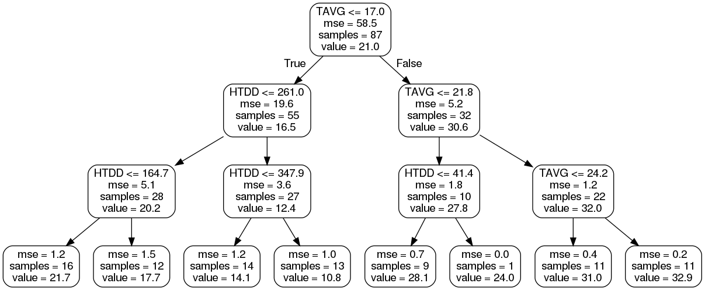

# DATA SCIENCE

This repository stores [Jupyter Notebooks] to demonstrate skills in [Data Science], [Artificial Intelligence], classification and regression problems with [Python], [Keras], [scikit-learn], [Matplotlib], [NumPy], [Pandas], [TPOT], [XGBoost], [Folium], [Seaborn] among others.

## DEPENDENCIES

The code has been tested using:

- [Python] (3.10): an interpreted high-level programming language for general-purpose programming.
- [Jupyter Lab] (4.2): a web-based interactive development environment for [Jupyter Notebooks], code, and data.
- [Keras] ([TensorFlow] built-in): a high-level neural networks [API], written in [Python] and capable of running on top of [TensorFlow], CNTK, or Theano.
- [TensorFlow] (2.16): an open source [Deep Learning] library for high performance numerical computation using data flow graphs.
- [Matplotlib] (3.9): a plotting library for [Python] and its numerical mathematics extension [NumPy].
- [NumPy] (1.26): a library for [Python], adding support for large, multi-dimensional arrays and matrices, along with a large collection of high-level mathematical functions to operate on these arrays.
- [Pandas] (2.2):  an open source library providing high-performance, easy-to-use data structures and data analysis tools for [Python].
- [scikit-learn] (1.5): a [machine learning] library for [Python]. It features various classification, regression and clustering algorithms including support vector machines, [random forest], [gradient boosting], k-means and DBSCAN.
- [scikit-image] (0.23): a collection of algorithms for image processing with [Python].
- [TPOT] (0.12): a [Python] Automated [Machine Learning] tool that optimizes [machine learning] pipelines using genetic programming.
- [XGBoost] (2.0): an optimized distributed [gradient boosting] library designed to be highly efficient, flexible and portable.
- [Folium] (0.16): an open source library to visualize data that has been manipulated in [Python] on an interactive [Leaflet.js] map.
- [ipyleaflet] (0.19): a [Jupyter] / [Leaflet.js] bridge enabling interactive maps in [Jupyter Notebook].
- [Seaborn] (0.13): a [Python] visualization library based on [Matplotlib]. It provides a high-level interface for drawing attractive statistical graphics.
- [imbalanced-learn] (0.12): a [Python] package offering a number of re-sampling techniques commonly used in datasets showing strong between-class imbalance. It is compatible with [scikit-learn] and it allows [SMOTE (Synthetic Minority Over-sampling Technique)].
- [joblib] (1.4): a set of tools to provide lightweight pipelining in [Python].
- [findspark] (2.0): a package to make [Spark] Context available in [Jupyter Notebook].

Virtual environment (<env_name>=**.venv**) can be generated with  **requirements.txt** file found in main folder.

Command to configure virtual environment with [venv]:

```bash
~/datascience$ python3 -m venv .venv
~/datascience$ source .venv/bin/activate
(.venv)~/datascience$ python3 -m pip install pip==24.0
(.venv)~/datascience$ python3 -m pip install setuptools==70.0.0
(.venv)~/datascience$ python3 -m pip install -r requirements.txt
```

### HOW TO RUN NOTEBOOKS

A good way to play with the [Jupyter Notebooks] is through [Jupyter Lab]. To run any of them use the command shown below:

```bash
(.venv)~/datascience$ jupyter lab <notebook_name>.ipynb
```

It might be also necessary to install locally [Graphviz] for rendering graph images with the command:

```bash
~/datascience$ sudo apt-get install graphviz
```

Graph image example of a decision tree is shown below.



## CREDITS

author: alvertogit
copyright: 2018-2024

[Data Science]: https://en.wikipedia.org/wiki/Data_science
[Artificial Intelligence]: https://en.wikipedia.org/wiki/Artificial_intelligence
[Python]: https://www.python.org/
[Machine Learning]: https://en.wikipedia.org/wiki/Machine_learning
[Deep Learning]: https://en.wikipedia.org/wiki/Deep_learning
[Random Forest]: https://en.wikipedia.org/wiki/Random_forest
[Gradient Boosting]: https://en.wikipedia.org/wiki/Gradient_boosting
[API]: https://en.wikipedia.org/wiki/Application_programming_interface
[Keras]: https://keras.io/
[TensorFlow]: https://www.tensorflow.org/
[Matplotlib]: https://matplotlib.org/
[NumPy]: https://numpy.org/
[Pandas]: https://pandas.pydata.org/
[scikit-learn]: https://scikit-learn.org/stable/
[scikit-image]: https://scikit-image.org/
[TPOT]: https://github.com/EpistasisLab/tpot
[XGBoost]: https://github.com/dmlc/xgboost
[Folium]: https://github.com/python-visualization/folium
[Leaflet.js]: https://leafletjs.com/
[ipyleaflet]: https://github.com/jupyter-widgets/ipyleaflet
[Seaborn]: http://seaborn.pydata.org/
[imbalanced-learn]: https://github.com/scikit-learn-contrib/imbalanced-learn
[SMOTE (Synthetic Minority Over-sampling Technique)]: https://jair.org/index.php/jair/article/view/10302
[joblib]: https://pypi.org/project/joblib/
[Jupyter]: https://jupyter.org/
[Jupyter Lab]: https://jupyter.org/
[Jupyter Notebook]: https://jupyter.org/
[Jupyter Notebooks]: https://jupyter.org/
[findspark]: https://github.com/minrk/findspark
[Spark]: https://spark.apache.org/
[venv]: https://docs.python.org/3/library/venv.html
[Graphviz]: https://www.graphviz.org/
